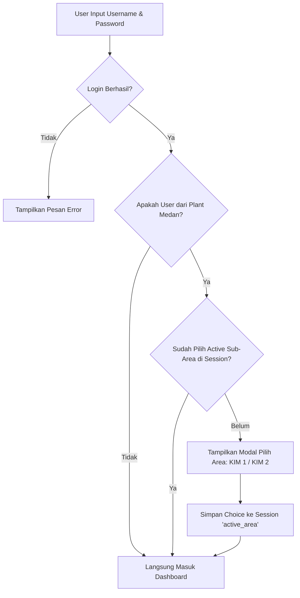

# Rencana Implementasi Sub-Area Plant Medan (KIM 1 & KIM 2)

> **Proyek**: Paperless Warehouse  
> **Topik**: Integrasi Pemisahan Area Medan KIM 1 & Medan KIM 2 pada Plant Medan  
> **Dokumen**: Rencana Teknis & Implementasi Architecture  
> **Tanggal**: 11 September 2026  

---

## 📌 1. Latar Belakang & Tujuan

Plant Medan memiliki 2 wilayah operasional terpisah yaitu **Medan KIM 1** dan **Medan KIM 2**. Namun secara administrasi manajemen, Plant Medan tetap merupakan **1 Plant Tunggal (`Plant Medan`)**.

### Tujuan Utamanya:
1. User dari Plant Medan tetap terdaftar di bawah 1 Master Plant (`Plant Medan`).
2. Pemisahan dilakukan pada level **Sub-Area** (`Medan KIM 1` & `Medan KIM 2`).
3. User cukup **memilih Area aktif 1x saja diawal saat login**.
4. Seluruh form input pemeriksaan otomatis merekam area aktif yang dipilih.
5. Data lama/eksisting tetap aman dan tidak hilang.
6. Laporan (Index, PDF, Excel) dapat ditarik secara **Total Medan** maupun **Filter per Area (KIM 1 / KIM 2)**.

---

## 🏗️ 2. Arsitektur & Alur Kerja Sistem (Workflow)



### Penjelasan Alur:
* **Session Key**: `session('active_area')` menyimpan string `'Medan KIM 1'` atau `'Medan KIM 2'`.
* **Navbar Badge & Switch Area**: Disediakan tombol kecil di Navbar untuk mengubah Area Aktif tanpa perlu logout.
* **Auto-Tagging**: Setiap [store()](file:///c:/laragon/www/paperless_wh/app/Http/Controllers/PlantController.php#40-58) / [create()](file:///c:/laragon/www/paperless_wh/app/Http/Controllers/PemeriksaanSuhuRuangV3Controller.php#60-72) pada form pemeriksaan akan otomatis menyuntikkan kolom `sub_area => session('active_area')`.

---

## 🗄️ 3. Perubahan Database & Trait Controller

### A. Migration Database
Menambahkan kolom `sub_area` (`nullable()`) pada 12 tabel transaksi pemeriksaan.

```php
Schema::table('pemeriksaan_suhu_ruang_v3s', function (Blueprint $table) {
    $table->string('sub_area')->nullable()->after('id_user')->comment('Medan KIM 1 / Medan KIM 2');
});
```

### B. Global Trait Model & Controller (`HasSubAreaSession`)
Membuat Trait untuk otomatisasi query & penanganan simpan data:

```php
namespace App\Traits;

use Illuminate\Support\Facades\Auth;

trait HasSubAreaSession
{
    protected static function bootHasSubAreaSession()
    {
        static::creating(function ($model) {
            if (empty($model->sub_area) && session()->has('active_area')) {
                $model->sub_area = session('active_area');
            }
        });
    }
}
```

---

## 📝 4. Daftar 12 Modul Form Pemeriksaan Yang Diintegrasikan

Berikut adalah 12 modul pemeriksaan yang akan diintegrasikan dengan fitur Sub-Area:

| No | Nama Modul / Form | File Controller | Model Utamanya |
| :---: | :--- | :--- | :--- |
| 1 | **Pemeriksaan Suhu Ruang V1** | [PemeriksaanSuhuRuangController.php](file:///c:/laragon/www/paperless_wh/app/Http/Controllers/PemeriksaanSuhuRuangController.php) | [PemeriksaanSuhuRuang](file:///c:/laragon/www/paperless_wh/app/Models/PemeriksaanSuhuRuang.php#10-111) |
| 2 | **Pemeriksaan Suhu Ruang V2** | [PemeriksaanSuhuRuangV2Controller.php](file:///c:/laragon/www/paperless_wh/app/Http/Controllers/PemeriksaanSuhuRuangV2Controller.php) | `PemeriksaanSuhuRuangV2` |
| 3 | **Pemeriksaan Suhu Ruang V3** | [PemeriksaanSuhuRuangV3Controller.php](file:///c:/laragon/www/paperless_wh/app/Http/Controllers/PemeriksaanSuhuRuangV3Controller.php) | [PemeriksaanSuhuRuangV3](file:///c:/laragon/www/paperless_wh/app/Http/Controllers/PemeriksaanSuhuRuangV3Controller.php#15-892) |
| 4 | **Pemeriksaan Kebersihan Area** | [PemeriksaanKebersihanAreaController.php](file:///c:/laragon/www/paperless_wh/app/Http/Controllers/PemeriksaanKebersihanAreaController.php) | `PemeriksaanKebersihanArea` |
| 5 | **Pemeriksaan Loading Produk** | [PemeriksaanLoadingProdukController.php](file:///c:/laragon/www/paperless_wh/app/Http/Controllers/PemeriksaanLoadingProdukController.php) | `PemeriksaanLoadingProduk` |
| 6 | **Pemeriksaan Loading Kendaraan** | [PemeriksaanLoadingKendaraanController.php](file:///c:/laragon/www/paperless_wh/app/Http/Controllers/PemeriksaanLoadingKendaraanController.php) | `PemeriksaanLoadingKendaraan` |
| 7 | **Kedatangan Bahan Baku Penunjang** | [PemeriksaanKedatanganBahanBakuPenunjangController.php](file:///c:/laragon/www/paperless_wh/app/Http/Controllers/PemeriksaanKedatanganBahanBakuPenunjangController.php) | `PemeriksaanKedatanganBahanBakuPenunjang` |
| 8 | **Kedatangan Chemical** | [PemeriksaanKedatanganChemicalController.php](file:///c:/laragon/www/paperless_wh/app/Http/Controllers/PemeriksaanKedatanganChemicalController.php) | `PemeriksaanKedatanganChemical` |
| 9 | **Kedatangan Kemasan** | [PemeriksaanKedatanganKemasanController.php](file:///c:/laragon/www/paperless_wh/app/Http/Controllers/PemeriksaanKedatanganKemasanController.php) | `PemeriksaanKedatanganKemasan` |
| 10 | **Produk Finish Good** | [PemeriksaanProdukFinishGoodController.php](file:///c:/laragon/www/paperless_wh/app/Http/Controllers/PemeriksaanProdukFinishGoodController.php) | `PemeriksaanProdukFinishGood` |
| 11 | **Return Barang Customer** | [PemeriksaanReturnBarangCustomerController.php](file:///c:/laragon/www/paperless_wh/app/Http/Controllers/PemeriksaanReturnBarangCustomerController.php) | `PemeriksaanReturnBarangCustomer` |
| 12 | **Golden Sample Report & Komplain** | [GoldenSampleReportController.php](file:///c:/laragon/www/paperless_wh/app/Http/Controllers/GoldenSampleReportController.php)<br>[DetailKomplainController.php](file:///c:/laragon/www/paperless_wh/app/Http/Controllers/DetailKomplainController.php)<br>[PemeriksaanBarangMudahPecahController.php](file:///c:/laragon/www/paperless_wh/app/Http/Controllers/PemeriksaanBarangMudahPecahController.php) | `GoldenSampleReport`<br>`DetailKomplain`<br>`PemeriksaanBarangMudahPecah` |

---

## 📊 5. Tampilan Halaman Index & Export Laporan

### A. Halaman Index (List Data)
1. **Dropdown Filter Area**:
   ```html
   <select name="sub_area" onchange="this.form.submit()">
       <option value="all">Semua Area (KIM 1 & KIM 2)</option>
       <option value="Medan KIM 1">Medan KIM 1</option>
       <option value="Medan KIM 2">Medan KIM 2</option>
   </select>
   ```
2. **Kolom Badge Area pada Tabel**:
   - `Medan KIM 1` ➔ Badge Biru `<span class="badge bg-primary">Medan KIM 1</span>`
   - `Medan KIM 2` ➔ Badge Hijau `<span class="badge bg-success">Medan KIM 2</span>`
   - `NULL / Eksisting` ➔ Badge Abu-abu `<span class="badge bg-secondary">Medan (Eksisting)</span>`

### B. Laporan PDF & Excel Export
- Menambahkan parameter `sub_area` pada filter Export PDF/Excel agar laporan bisa di-download khusus KIM 1, khusus KIM 2, atau gabungan.

---

## 🛠️ 6. Penanganan Data Eksisting (Data Migration)

Untuk data yang sudah ada sebelum fitur ini dibuat:
* **Default Status**: Data lama memiliki nilai `sub_area = NULL`.
* **Display UI**: Tampil sebagai **`Medan (Eksisting)`** sehingga tidak membingungkan.
* **Option Bulk Backfill (Script SQL)**:
  Jika dibutuhkan, kita bisa menjalankan query update untuk memberi tag data lama sebagai `Medan KIM 1`:
  ```sql
  UPDATE pemeriksaan_suhu_ruang_v3s 
  SET sub_area = 'Medan KIM 1' 
  WHERE sub_area IS NULL;
  ```

---

## 🚀 7. Rencana Tahapan Eksekusi (Roadmap Execution)

- [ ] **Fase 1: Database Migration & Session Middleware**
  - Buat migration penambahan kolom `sub_area` pada 12 tabel pemeriksaan.
  - Buat Middleware `CheckMedanSubArea` dan Modal UI Pemilihan Area pasca-login.
  - Buat Trait `HasSubAreaSession`.

- [ ] **Fase 2: Integrasi Controller & Model (12 Modul)**
  - Pasang Trait pada Model & Controller 12 modul pemeriksaan.
  - Update method [store()](file:///c:/laragon/www/paperless_wh/app/Http/Controllers/PlantController.php#40-58) agar otomatis menyertakan `sub_area`.
  - Update method [index()](file:///c:/laragon/www/paperless_wh/app/Http/Controllers/PemeriksaanSuhuRuangV3Controller.php#17-59) agar mendukung filter `sub_area`.

- [ ] **Fase 3: UI Enhancement & Export PDF/Excel**
  - Tambahkan dropdown filter & badge area pada view `index.blade.php`.
  - Update class Export Excel & View Template PDF untuk menampilkan label `sub_area`.

- [ ] **Fase 4: Testing & Data Verification**
  - Uji alur login Plant Medan & pilihan area.
  - Uji simpan data baru di KIM 1 dan KIM 2.
  - Uji kompatibilitas data eksisting (lama).
